> 010SublimeText的ST扩展支持

> Tags: #工具 #AS

- [1 SublimeText是什么？](#1%20SublimeText%E6%98%AF%E4%BB%80%E4%B9%88%EF%BC%9F)
- [2 在AS项目中为什么建议结合SublimeText使用？](#2%20%E5%9C%A8AS%E9%A1%B9%E7%9B%AE%E4%B8%AD%E4%B8%BA%E4%BB%80%E4%B9%88%E5%BB%BA%E8%AE%AE%E7%BB%93%E5%90%88SublimeText%E4%BD%BF%E7%94%A8%EF%BC%9F)
	- [2.1 SublimeText可方便扩展，可针对贝加莱StrutureText文本代码实现代码高亮](#2.1%20SublimeText%E5%8F%AF%E6%96%B9%E4%BE%BF%E6%89%A9%E5%B1%95%EF%BC%8C%E5%8F%AF%E9%92%88%E5%AF%B9%E8%B4%9D%E5%8A%A0%E8%8E%B1StrutureText%E6%96%87%E6%9C%AC%E4%BB%A3%E7%A0%81%E5%AE%9E%E7%8E%B0%E4%BB%A3%E7%A0%81%E9%AB%98%E4%BA%AE)
	- [2.2 更好的支持贝加莱中文编码，避免保存乱码问题](#2.2%20%E6%9B%B4%E5%A5%BD%E7%9A%84%E6%94%AF%E6%8C%81%E8%B4%9D%E5%8A%A0%E8%8E%B1%E4%B8%AD%E6%96%87%E7%BC%96%E7%A0%81%EF%BC%8C%E9%81%BF%E5%85%8D%E4%BF%9D%E5%AD%98%E4%B9%B1%E7%A0%81%E9%97%AE%E9%A2%98)
	- [2.3 打开速度快](#2.3%20%E6%89%93%E5%BC%80%E9%80%9F%E5%BA%A6%E5%BF%AB)
	- [2.4 同名变量自动高亮，同步修改](#2.4%20%E5%90%8C%E5%90%8D%E5%8F%98%E9%87%8F%E8%87%AA%E5%8A%A8%E9%AB%98%E4%BA%AE%EF%BC%8C%E5%90%8C%E6%AD%A5%E4%BF%AE%E6%94%B9)
	- [2.5 支持多行同时修改](#2.5%20%E6%94%AF%E6%8C%81%E5%A4%9A%E8%A1%8C%E5%90%8C%E6%97%B6%E4%BF%AE%E6%94%B9)
	- [2.6 6.开启VIM模式编辑](#2.6%206.%E5%BC%80%E5%90%AFVIM%E6%A8%A1%E5%BC%8F%E7%BC%96%E8%BE%91)
	- [2.7 与Sublime Merge结合可高效版本控制Blame代码](#2.7%20%E4%B8%8ESublime%20Merge%E7%BB%93%E5%90%88%E5%8F%AF%E9%AB%98%E6%95%88%E7%89%88%E6%9C%AC%E6%8E%A7%E5%88%B6Blame%E4%BB%A3%E7%A0%81)
		- [2.7.1 Git Blame](#2.7.1%20Git%20Blame)
		- [2.7.2 Blame File](#2.7.2%20Blame%20File)
- [3 如何下载与配置](#3%20%E5%A6%82%E4%BD%95%E4%B8%8B%E8%BD%BD%E4%B8%8E%E9%85%8D%E7%BD%AE)
	- [3.1 下载链接](#3.1%20%E4%B8%8B%E8%BD%BD%E9%93%BE%E6%8E%A5)
	- [3.2 配置下载与配置](#3.2%20%E9%85%8D%E7%BD%AE%E4%B8%8B%E8%BD%BD%E4%B8%8E%E9%85%8D%E7%BD%AE)

# 1 SublimeText是什么？

- 文本编辑器，官方网站为：[Sublime Text - Text Editing, Done Right](https://www.sublimetext.com/)
- Sublime Text 支持多种编程语言的语法高亮、拥有优秀的代码自动完成功能，还拥有代码片段（Snippet）的功能，可以将常用的代码片段保存起来，在需要时随时调用。支持 <span style="background:#F0A7D8">VIM</span> 模式，可以使用Vim模式下的多数命令。
- Sublime Text 还具有良好的扩展能力，可以自行开发扩展功能，便于使用。
- 同等定位的软件有
    - NotePad
        - 
    - Notepad++
        - 
    - VisualStudio Code
        - 

# 2 在AS项目中为什么建议结合SublimeText使用？

## 2.1 SublimeText可方便扩展，可针对贝加莱StrutureText文本代码实现代码高亮

- 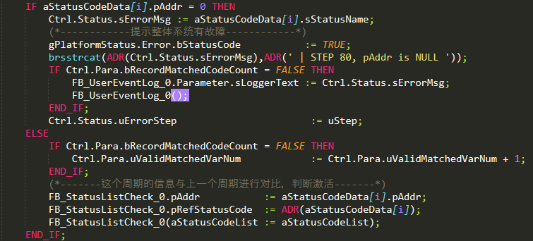

## 2.2 更好的支持贝加莱中文编码，避免保存乱码问题

- 目前AutomationStudio中文本均是已ANSI编码存储。
- 使用VS Code等编辑器开发，默认以UTF-8编码打开，保存容易导致中文信息全部丢失
- 若需要切换编码，则每次均需手动转换，使用不方便
    - 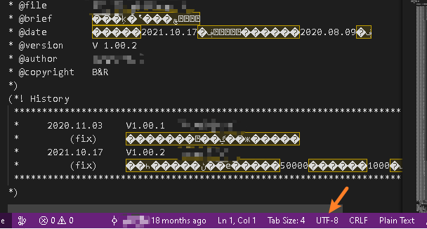
- 通过使用SublimeText 的ConvertToUTF8插件，能够很好的解决此问题，自动猜测编码并显示，并以正确编码存储
- 若需要使用VS Code，建议在Settings → Text Editor → Files → Auto Guess Encoding 打勾
    - 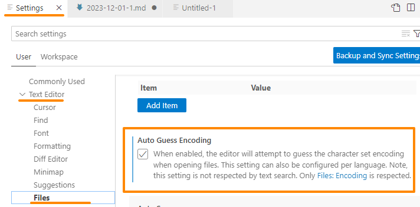

## 2.3 打开速度快

- SublimeText的软件打开速度远比Visual Studio Code 快速，与Notepad++ 一致。

## 2.4 同名变量自动高亮，同步修改

- <span style="background:#F0A7D8">a. </span>确认目前处于INSERT Mode ( 右下角提示如下信息）
    - 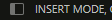
- <span style="background:#F0A7D8">b. </span>选择变量
- <span style="background:#F0A7D8">c. </span>按 `CTRL + D` 或者 `ALT + 鼠标左键双击` 把所有同名变量依次选中，或者按 `ALT + F3` 全选本文本中所有同名变量，可以跨行，选择完成整合文件中同名变量
- <span style="background:#F0A7D8">d. </span>输入需要修改的变量，变量批量自动修改
    - 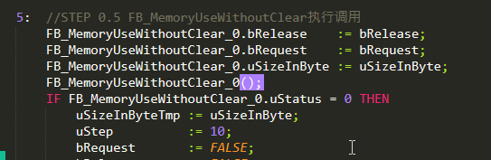

## 2.5 支持多行同时修改

- <span style="background:#F0A7D8">a. </span>鼠标选中需要修改的行
- <span style="background:#F0A7D8">b. </span>按 `CTRL + SHIFT + L`
    - 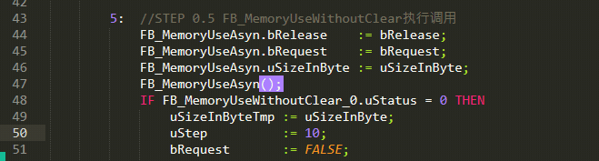

## 2.6 6.开启VIM模式编辑

- 左上角选择`Prefernces —> Settings`
- 在右侧确认Vintage没有被添加进忽略的包

```
{
	"ignored_packages":
	[

	],
}
```

- 编辑时按`ESC`即进入VIM模式
- 如何进入普通编辑模式：在COMMAND模式下按`i`

## 2.7 与Sublime Merge结合可高效版本控制Blame代码

### 2.7.1 Git Blame

- 在SublimeText软件下，对受git版本控制的代码，指定任意行，右键选择Git Blame，可见谁修改的的代码。
- 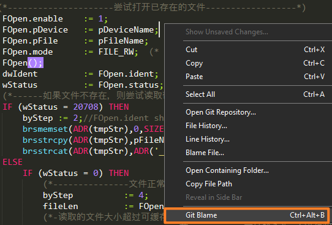
- 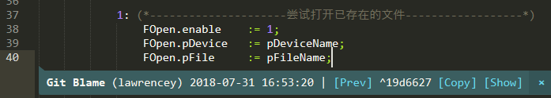

### 2.7.2 Blame File

- 在SublimeText软件下，右键Blame File...
- 在安装了Sublime Merge的情况下，自动会跳转到Sublime Merge软件
    - 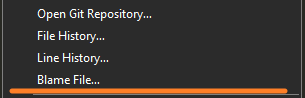
- 每行代码是由谁修改一目了然，并可以根据历史的提交日志判断此代码的编写原因与关联性
    - 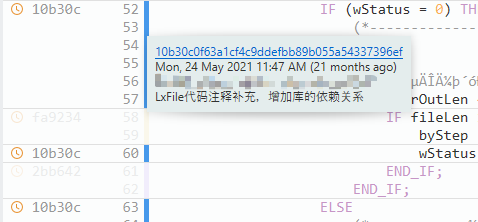
- 在SublimeMerge中看到的任何代码，右键Open in Editor...将自动跳转到Sublime Text软件指向对应行打开
    - 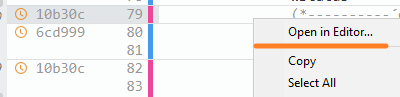
    - 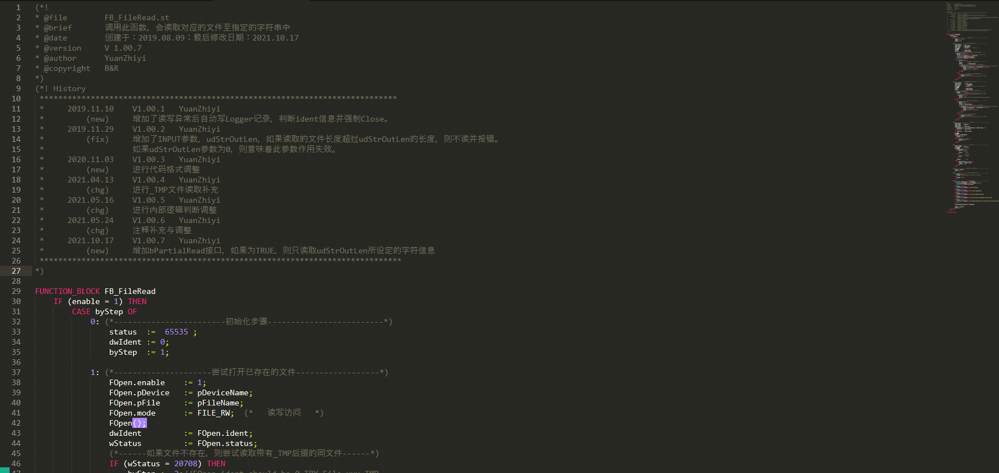

# 3 如何下载与配置

## 3.1 下载链接

- [Sublime Text - Text Editing, Done Right](https://www.sublimetext.com/)
- [Sublime Merge | Git client from the makers of Sublime Text](https://www.sublimemerge.com/)

## 3.2 配置下载与配置

- 下载链接
    - PC知识库
        - [贝加莱知识库 (huashengyun.online)](https://brtechs.huashengyun.online/index.php?mod=bjl&do=file&gid=19#group&do=file&gid=19&fid=3110)
    - 百度网盘链接：
        - https://pan.baidu.com/s/1D2vRRkddlCukOqqi0JpOmg?pwd=8jp4
- 配置
    - 下载配置文件后，将以下三个文件夹解压拷贝至以下路径即可
    - 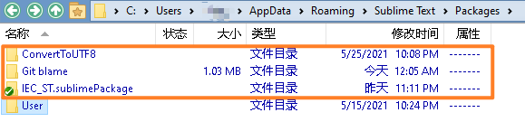
