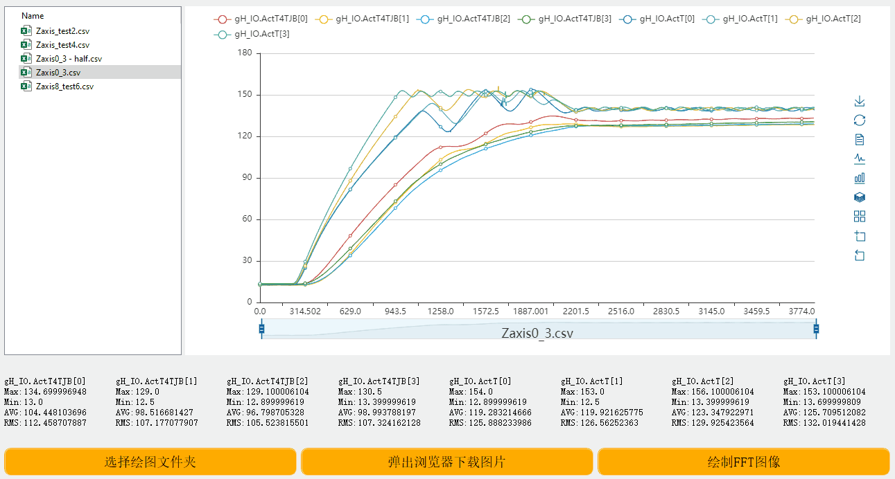

> 011贝加莱Trace数据可视化工具

> Tags: #工具 #AS #数据分析

- [1 工具简介](#1%20%E5%B7%A5%E5%85%B7%E7%AE%80%E4%BB%8B)
- [2 下载地址](#2%20%E4%B8%8B%E8%BD%BD%E5%9C%B0%E5%9D%80)
- [3 功能介绍](#3%20%E5%8A%9F%E8%83%BD%E4%BB%8B%E7%BB%8D)
	- [3.1 UI界面](#3.1%20UI%E7%95%8C%E9%9D%A2)
	- [3.2 绘图界面](#3.2%20%E7%BB%98%E5%9B%BE%E7%95%8C%E9%9D%A2)
- [4 使用方法](#4%20%E4%BD%BF%E7%94%A8%E6%96%B9%E6%B3%95)
	- [4.1 折线图区域缩放与还原](#4.1%20%E6%8A%98%E7%BA%BF%E5%9B%BE%E5%8C%BA%E5%9F%9F%E7%BC%A9%E6%94%BE%E4%B8%8E%E8%BF%98%E5%8E%9F)
	- [4.2 缩放栏查看特定区间数据](#4.2%20%E7%BC%A9%E6%94%BE%E6%A0%8F%E6%9F%A5%E7%9C%8B%E7%89%B9%E5%AE%9A%E5%8C%BA%E9%97%B4%E6%95%B0%E6%8D%AE)
	- [4.3 将折线图转为柱状图](#4.3%20%E5%B0%86%E6%8A%98%E7%BA%BF%E5%9B%BE%E8%BD%AC%E4%B8%BA%E6%9F%B1%E7%8A%B6%E5%9B%BE)
	- [4.4 下载图片](#4.4%20%E4%B8%8B%E8%BD%BD%E5%9B%BE%E7%89%87)
	- [4.5 绘制FFT图像](#4.5%20%E7%BB%98%E5%88%B6FFT%E5%9B%BE%E5%83%8F)

# 1 工具简介

- 对贝加莱Trace数据，实现更加直观易用的可视化显示。
- 

# 2 下载地址

- 贝加莱PC知识库
    - [贝加莱知识库 (huashengyun.online)](https://brtechs.huashengyun.online/index.php?mod=bjl&do=file&gid=19#group&do=file&gid=19&fid=3124)
- 百度网盘
    - 链接：https://pan.baidu.com/s/1RbZ2Sz8VQFTKQCMTCMHYMA?pwd=xiqb

# 3 功能介绍

## 3.1 UI界面

- 
- 程序共分为如下六个区域：
    - 选择绘图文件夹区
        - 默认显示exe程序所在文件夹csv文件格式内容，在点击**4. 选择绘图文件夹按钮** 按钮后会显示选择后的文件夹
    - 图像展示区
        - 双击**1. 选择绘图文件夹区** csv文件，即可绘图，默认显示选择的csv文件折线图
    - 变量展示区
        - 与**2.图像展示区** 显示的折线图联动展示，主要显示各变量Max（最大值）、Min（最小值）、AVG（平均值）、RMS（均方根值）
    - 选择绘图文件夹按钮
        - 点击后会弹出系统文件资源页面，需要选择文件所在的文件夹
    - 弹出浏览器下载图片按钮
        - 系统弹出浏览器,点击下载按钮后，可以利用浏览器下载功能下载
    - 绘制FFT图像按钮
        - 点击按钮后，自动解析出全部变量FFT图像

## 3.2 绘图界面

- 
- 绘图模块共分为如下五个部分：
    - 图例栏
        - 可以点击变量名，显示或隐藏曲线
    - 工具箱栏
        - 可以利用工具箱按钮进行刷新图表，将折线图转为柱状图，将图表堆叠显示，选择区域进行缩放等操作
    - Y坐标线栏
        - 点击图表曲线后，即可显示当前x坐标下各折线Y值信息
    - 缩放栏
        - 通过拖动两边的方框，可以对选择需要展示的X轴区域
        - 通过滑动方框，可以选择需要展现X轴的区间
    - 文件信息
        - 展示读取文件名

# 4 使用方法

## 4.1 折线图区域缩放与还原

- 
- 点击工具箱栏**区域缩放** 按钮可以选择折线缩放区域
- 点击工具箱栏**缩放还原** 按钮可以还原到缩放上一步
- 点击工具栏**store** 按钮可以全部刷新，直接还原图像

## 4.2 缩放栏查看特定区间数据

- 
- 可以拖动底部缩放栏，选择需要查看的数据区间

## 4.3 将折线图转为柱状图

- 
- 点击工具箱栏**柱状图** 按钮可以将图像转为柱状图

## 4.4 下载图片

- 
- 点击下载图片按钮，弹出文件浏览器，点击工具栏**save as image** 按钮进行下载图片

## 4.5 绘制FFT图像

- 
- 点击绘制FFT图像按钮，即可绘制出FFT图像
