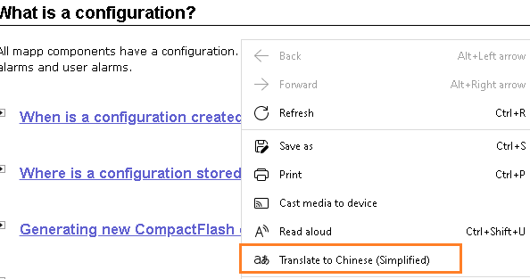

> # 贝加莱帮助自动翻译工具

> Tags: #工具 #AS帮助

- [1 工具说明](#1%20%E5%B7%A5%E5%85%B7%E8%AF%B4%E6%98%8E)
- [2 使用说明](#2%20%E4%BD%BF%E7%94%A8%E8%AF%B4%E6%98%8E)
- [3 实现思路](#3%20%E5%AE%9E%E7%8E%B0%E6%80%9D%E8%B7%AF)
- [4 注意事项](#4%20%E6%B3%A8%E6%84%8F%E4%BA%8B%E9%A1%B9)
- [5 软件下载地址](#5%20%E8%BD%AF%E4%BB%B6%E4%B8%8B%E8%BD%BD%E5%9C%B0%E5%9D%80)

# 1 工具说明

- 便于中国客户更快的找到帮助中的信息，可以借助工具，以中文的方式看懂帮助。
- 增强搜索功能，能快找到想知道的信息
- 演示效果
    - 
- 可自定义目录翻译内容
    - 

# 2 使用说明

1. 选择AS版本，运行。
2. 点击相关条目，自动跳转到浏览器翻译。
3. 过滤窗口输入信息后，全局过滤对应条目的目录，可能会耗时较长。
4. 你可以自己编辑翻译文件translation.json来调整目录条目的翻译内容。

# 3 实现思路

1. 自动获取本地安装的AS Help路径
2. 解析路径文件，形成与使用Automation Help相同的多层嵌套目录结构
3. 点击条目，自动通过默认浏览器加载帮助文件
4. 通过浏览器自带的翻译功能，进行翻译。

# 4 注意事项

1. 请确认本地安装了Google浏览器 \ Edge浏览器 （推荐Edge浏览器）
2. 请将浏览器设置为默认浏览器
3. 使用工具点击一页后，浏览器显示原本信息
4. 右键选择翻译至中文
    - 
5. 在网址输入框右侧，提示的选项中勾选 `Always translate pages from English`
- 
1. 操作几次之后，通过工具点击浏览的帮助页面即会自动翻译
2. 建议使用方式，在屏幕上并列软件与浏览器。
- 

# 5 软件下载地址

- [贝加莱知识库 (huashengyun.online)](https://brtechs.huashengyun.online/index.php?mod=bjl&do=file&gid=19#group&do=file&gid=19&fid=2850)
    - 
- 解压后，双击执行EXE文件。
