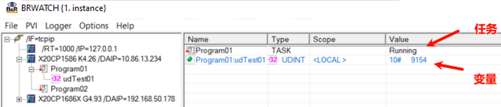
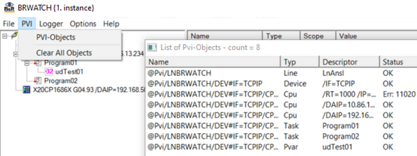

> Tags: #PVI #工具软件

- [1 C07.013-在线控制PLC与采集变量软件brwatch](#_1-c07013-%E5%9C%A8%E7%BA%BF%E6%8E%A7%E5%88%B6plc%E4%B8%8E%E9%87%87%E9%9B%86%E5%8F%98%E9%87%8F%E8%BD%AF%E4%BB%B6brwatch)
- [2 软件来源下载](#_2-%E8%BD%AF%E4%BB%B6%E6%9D%A5%E6%BA%90%E4%B8%8B%E8%BD%BD)
- [3 软件使用要求](#_3-%E8%BD%AF%E4%BB%B6%E4%BD%BF%E7%94%A8%E8%A6%81%E6%B1%82)
- [4 软件介绍](#_4-%E8%BD%AF%E4%BB%B6%E4%BB%8B%E7%BB%8D)
- [5 注意事项](#_5-%E6%B3%A8%E6%84%8F%E4%BA%8B%E9%A1%B9)
- [6 使用说明](#_6-%E4%BD%BF%E7%94%A8%E8%AF%B4%E6%98%8E)
	- [6.1 扫描连接PLC，更改PLC状态](#_61-%E6%89%AB%E6%8F%8F%E8%BF%9E%E6%8E%A5plc%EF%BC%8C%E6%9B%B4%E6%94%B9plc%E7%8A%B6%E6%80%81)
	- [6.2 Watch 任务及变量](#_62-watch-%E4%BB%BB%E5%8A%A1%E5%8F%8A%E5%8F%98%E9%87%8F)
		- [6.2.1 修改任务状态](#_621-%E4%BF%AE%E6%94%B9%E4%BB%BB%E5%8A%A1%E7%8A%B6%E6%80%81)
		- [6.2.2 修改变量值](#_622-%E4%BF%AE%E6%94%B9%E5%8F%98%E9%87%8F%E5%80%BC)
	- [6.3 存取watch配置](#_63-%E5%AD%98%E5%8F%96watch%E9%85%8D%E7%BD%AE)
	- [6.4 logger功能记录变量（类似AS软件的Trace功能）](#_64-logger%E5%8A%9F%E8%83%BD%E8%AE%B0%E5%BD%95%E5%8F%98%E9%87%8F%EF%BC%88%E7%B1%BB%E4%BC%BCas%E8%BD%AF%E4%BB%B6%E7%9A%84trace%E5%8A%9F%E8%83%BD%EF%BC%89)
	- [6.5 PVI对象监控](#_65-pvi%E5%AF%B9%E8%B1%A1%E7%9B%91%E6%8E%A7)
	- [6.6 设置](#_66-%E8%AE%BE%E7%BD%AE)
- [7 更新日志](#_7-%E6%9B%B4%E6%96%B0%E6%97%A5%E5%BF%97)

# 1 C07.013-在线控制PLC与采集变量软件brwatch

- 对现场运行的PLC，希望查看其中某个变量的信息，控制PLC重启，原本这些操作只能通过Automation Studio软件或者使用Runtime Utility Center软件的命令行实现。
- 现在可通过 brwatch软件，轻松实现如下功能：
    - 扫描到网络内的PLC并连接。
    - 浏览PLC内的变量结构，并对任意变量进行查看数值与修改。
        - 
    - 控制PLC的状态，实现远程重启。
        - 

# 2 软件来源下载

- 此软件来源为github的开源项目
    - [GitHub - hilch/brwatch: brwatch: service tool for B&R plc: watch, change, log variables, set ip adresses etc.](https://github.com/hilch/brwatch)
- [点击直接下载 brwatch 1.4.1 软件压缩包（大小为 108 KB） ](/C07_工具/FILES/013在线控制PLC与采集变量软件brwatch/brwatch_1.4.1.zip ':ignore')
- Github下载
    - [Releases · hilch/brwatch (github.com)](https://github.com/hilch/brwatch/releases)

# 3 软件使用要求

- 在Windows电脑上安装了贝加莱 PVI 软件
    - 点击下载链接下载并安装：
        - [PVI Development Setup | B&R Industrial Automation (br-automation.com)](https://www.br-automation.com/en/downloads/software/automation-netpvi/pvi-development-setup/)
- Windows电脑与需要访问的贝加莱PLC在同一网段
    - 即Windows能够 ping 通 PLC

# 4 软件介绍

- brwatch是一款用于贝加莱自动化控制 (PLC)的小型便携式服务工具。它在 Microsoft Windows 上运行，使您能够列出、监视和更改过程变量、启动和停止任务、搜索和重新启动 CPU、更改 IP 设置。此外，它还能将 PV 值记录到 CSV 文件中，类似于trace数据文件。
- 使用逻辑：左侧列表双击刷新浏览，右侧显示PLC与变量的数据。
- brwatch 基于贝加莱协议 ANSL/INA
    - 所有 B&R 控制装置都支持 INA 协议的在线通信，但较新的 plc 也支持 ANSL。自 4.x 版起，PVI 同时支持 INA 和 ANSL。
    - Brwatch 也支持这两种协议，但不是同时支持。因此，从 V1.ini 中设置 "ANSL=1"，就可以使用较新的 ANSL 协议。当然，在这种情况下，您将无法联系基于 AR 3.x 的旧 PLC。
        - 

# 5 注意事项

- 如果没有PVI授权的话，brwatch仅能持续运行2小时。此后需要重启PVI Manager才能继续使用brwatch
    - 没有 PVI 许可证 1TG0500.02（+ TG Guard 例如 0TG1000.02）PVI 将运行两个小时。在此期间之后，brwatch 将停止工作，并且必须停止并重新启动 PVI-Manager。若有需要，并联系您当地的 B&R 办事处购买有效的许可证。
- 首次使用brwatch时双击brwatch.exe会在exe执行文件的同目录下自动生成一个brwatch.ini文件，等它自动配置完成就可以再次点击brwatch.exe进行操作（会自动启动PVI Manager）
    - 

# 6 使用说明

## 6.1 扫描连接PLC，更改PLC状态

- 
- 点击后可能需要等待一段时间，软件会卡一会，之后就能正常刷新到数据
- 
- 鼠标左键按住PLC图标拖放到右侧窗口可以监控PLC状态，在右侧窗口中双击PLC图标可以查看PLC的AR、IP地址、MAC地址、运行状态、SNMP信息。修改ETH属性（IP地址，子网掩码、网关，或由DHCP服务器自动分配），改变PLC运行模式。
- 

## 6.2 Watch 任务及变量

- 依次单击1（PLC），2（任务），3（变量）
    - 
- 将任务、变量拖放到右侧watch窗口可以进行查看和修改
    - 

### 6.2.1 修改任务状态

- 双击任务后出现如下弹窗
    - 
- Stop：停止任务；
- Resume：恢复任务运行；
- Start：与后面的Cycles输入值配合，按指定周期数执行任务，执行完成后停止任务。完成后使用resume无法恢复长时间run状态，需要先点击stop，再点resume才行。

### 6.2.2 修改变量值

- 双击变量进行变量值的修改。
    - 

## 6.3 存取watch配置

- 在brwatch软件的菜单栏File中可将当前watch的配置存储/读取，方便复用。
    - 

## 6.4 logger功能记录变量（类似AS软件的Trace功能）

- 点击brwatch菜单栏中的Logger功能。Logger configuration中可以定义Logger文件存储的位置，最大文件大小，记录周期，记录方式，以及是否使用压缩方式记录（可以使用File-Unzip logger file进行解压）。
- 点击Logger-Logger Start/Logger Stop启停Logger记录。
    - 
    - 
    - 

## 6.5 PVI对象监控

- 点击brwatch菜单栏中的PVI功能可以检测到当前通过PVI连接的对象，点击Clear all object会清空所有对象并断开连接，此时需要重新依次点击/if=tcpip，PLC，任务，变量来重新建立连接。
- 

## 6.6 设置

- 修改目录下的.ini文件进行参数修改。

# 7 更新日志

| 日期         | 修改人 | 修改内容       |
| :--------- | :-- | :--------- |
| 2024-03-15 | CJP | 初次创建编写文档初版 |
| 2024-03-15 | YZY | 修改并更新文档    |
