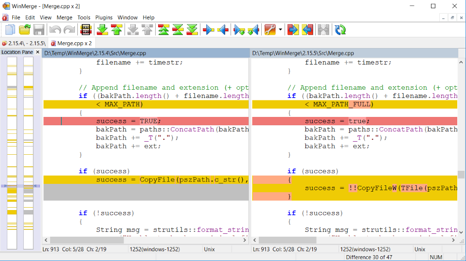
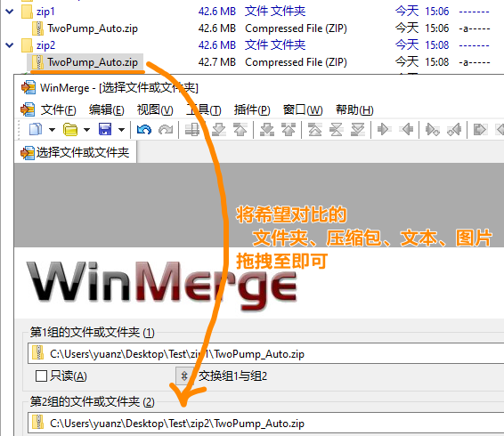
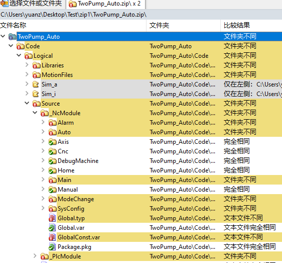
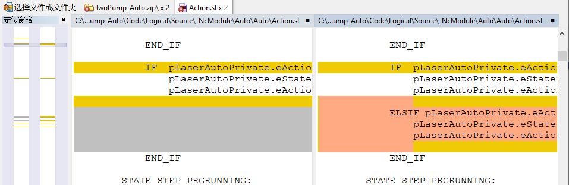
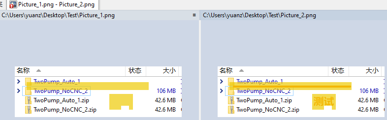

> Tags: #代码对比

- [1 C07.014.代码文本对比工具WinMerge](#_1-c07014%E4%BB%A3%E7%A0%81%E6%96%87%E6%9C%AC%E5%AF%B9%E6%AF%94%E5%B7%A5%E5%85%B7winmerge)
- [2 下载地址](#_2-%E4%B8%8B%E8%BD%BD%E5%9C%B0%E5%9D%80)
- [3 使用说明](#_3-%E4%BD%BF%E7%94%A8%E8%AF%B4%E6%98%8E)
- [4 效果案例](#_4-%E6%95%88%E6%9E%9C%E6%A1%88%E4%BE%8B)
	- [4.1 压缩包对比](#_41-%E5%8E%8B%E7%BC%A9%E5%8C%85%E5%AF%B9%E6%AF%94)
	- [4.2 图片对比](#_42-%E5%9B%BE%E7%89%87%E5%AF%B9%E6%AF%94)
- [5 更新日志](#_5-%E6%9B%B4%E6%96%B0%E6%97%A5%E5%BF%97)

# 1 C07.014.代码文本对比工具WinMerge

- 使用场景
    - 项目代码工程师喜欢打包成压缩包备份，想知道几个压缩包差异，人工对比非常麻烦。
    - 原本使用BeyondCompare软件，但此软件收费
- ⭐开源免费软件WinMerge软件
    - WinMerge 是一款适用于 Windows 的 **开源** 差异和合并工具。
    - WinMerge 可以比较文件夹和文件，以可视化文本格式显示差异，易于理解和处理。
    - 

# 2 下载地址

- [官方网站 → WinMerge - You will see the difference…](https://winmerge.org/)
- [前往贝加莱下载中心 → 快速下载](https://br-community.com/downloadDis/267)

# 3 使用说明

- 在任意文件夹下，右键即可打开此软件，且默认对比文件夹
    - 
- 对希望对比的内容，拖拽文件名称即可，支持文件夹、压缩包、文本、图片等等
    - 

# 4 效果案例

## 4.1 压缩包对比

- 自动解压两个压缩包，以树状结构列出差异，进行对比
- 
- 

## 4.2 图片对比

- 

# 5 更新日志

| 日期                             | 修改人 | 修改内容 |
| :----------------------------- | :-- | :--- |
| 2024-07-07 | YZY | 初次创建 |
