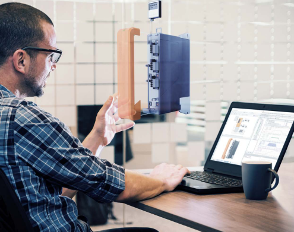
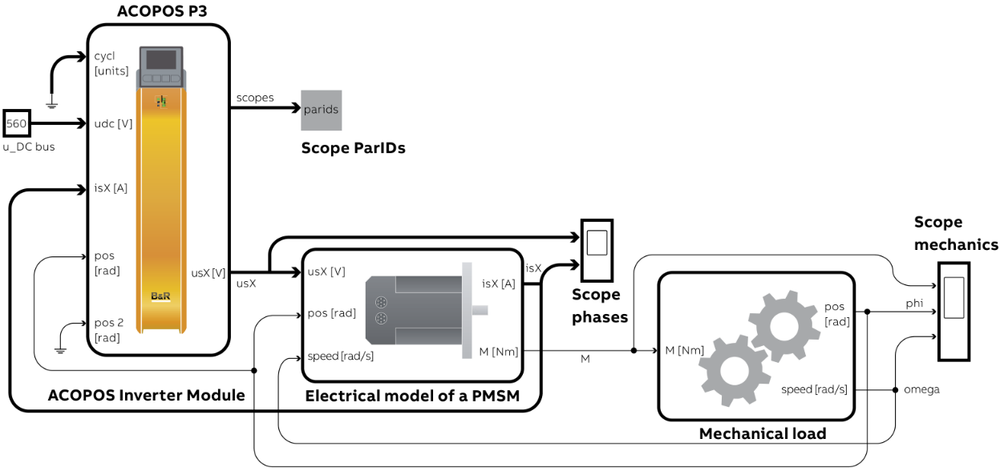
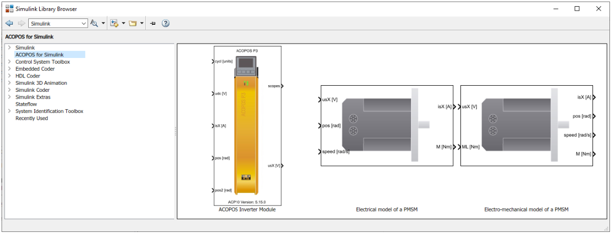
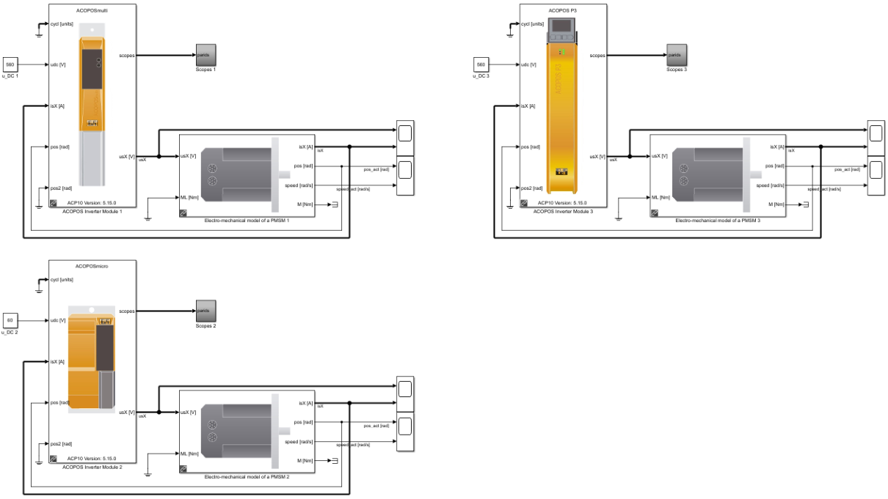
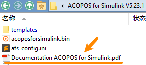

> 001ACOPOS_Simulink_利用MATLAB_Simulink更快实现完美的驱动解决方案

> Tags: #仿真 #ACOPOS

- [1 ACOPOS for Simulink](#1%20ACOPOS%20for%20Simulink)
	- [1.1 仿真取代了昂贵而耗时的真实硬件测试](#1.1%20%E4%BB%BF%E7%9C%9F%E5%8F%96%E4%BB%A3%E4%BA%86%E6%98%82%E8%B4%B5%E8%80%8C%E8%80%97%E6%97%B6%E7%9A%84%E7%9C%9F%E5%AE%9E%E7%A1%AC%E4%BB%B6%E6%B5%8B%E8%AF%95)
	- [1.2 只需按下按钮，即可将完整的驱动解决方案导入 MATLAB/Simulink。](#1.2%20%E5%8F%AA%E9%9C%80%E6%8C%89%E4%B8%8B%E6%8C%89%E9%92%AE%EF%BC%8C%E5%8D%B3%E5%8F%AF%E5%B0%86%E5%AE%8C%E6%95%B4%E7%9A%84%E9%A9%B1%E5%8A%A8%E8%A7%A3%E5%86%B3%E6%96%B9%E6%A1%88%E5%AF%BC%E5%85%A5%20MATLAB/Simulink%E3%80%82)
	- [1.3 更好的程序代码](#1.3%20%E6%9B%B4%E5%A5%BD%E7%9A%84%E7%A8%8B%E5%BA%8F%E4%BB%A3%E7%A0%81)
- [2 👍为机器制造商带来的益处](#2%20%F0%9F%91%8D%E4%B8%BA%E6%9C%BA%E5%99%A8%E5%88%B6%E9%80%A0%E5%95%86%E5%B8%A6%E6%9D%A5%E7%9A%84%E7%9B%8A%E5%A4%84)
- [3 👍为生产厂家带来的益处](#3%20%F0%9F%91%8D%E4%B8%BA%E7%94%9F%E4%BA%A7%E5%8E%82%E5%AE%B6%E5%B8%A6%E6%9D%A5%E7%9A%84%E7%9B%8A%E5%A4%84)
- [4 下载与使用](#4%20%E4%B8%8B%E8%BD%BD%E4%B8%8E%E4%BD%BF%E7%94%A8)
	- [4.1 使用方式演示](#4.1%20%E4%BD%BF%E7%94%A8%E6%96%B9%E5%BC%8F%E6%BC%94%E7%A4%BA)
	- [4.2 更多信息](#4.2%20%E6%9B%B4%E5%A4%9A%E4%BF%A1%E6%81%AF)
- [5 更新日志](#5%20%E6%9B%B4%E6%96%B0%E6%97%A5%E5%BF%97)

# 1 ACOPOS for Simulink

- 使用 MATLAB/ Simulink 仿真工具，B&R 可以更轻松地开发和优化机器。这是因为 B&R 驱动器和电机现在可以直接在仿真环境中进行测试和优化。无需使用其他工具，从而缩短了整体开发时间。

## 1.1 仿真取代了昂贵而耗时的真实硬件测试

- 

## 1.2 只需按下按钮，即可将完整的驱动解决方案导入 MATLAB/Simulink。

- 
- 为了模拟驱动解决方案，开发人员需要创建一个动态模型，例如根据机器模型的 CAD 数据，并将其导入 MATLAB/Simulink。使用 ACOPOS for Simulink 库，可将该模型与 B&R 驱动器的不同型号连接起来。
- 开发人员可直接在 MATLAB/Simulink 中测试模型的不同变种并分析所有数值和数据。支持 ACOPOS 伺服驱动器和各种永磁同步电机。

## 1.3 更好的程序代码

- 在仿真环境中，可以在模拟的真实的时间内查看相电压、相电流或负载速度等物理变量以及驱动器的内部状态，使开发人员能够轻松确定驱动器组件的最佳组合并设计完美的控制解决方案。
- 运动和自整定（auto tuning）等简单过程也可编程，这有助于防止开发错误并提高应用代码的质量。调试所需的时间和精力也随之减少。

# 2 👍为机器制造商带来的益处

- 缩短上市时间
- 提升代码质量
- 优化的驱动解决方案可节约成本

# 3 👍为生产厂家带来的益处

- 调试更快
- 减少出错的可能性
- 更低的维护成本
- 更好的控制质量

# 4 下载与使用

- 下载地址
    - [ACOPOS for Simulink | B&R Industrial Automation (br-automation.com)](https://www.br-automation.com/en/downloads/software/simulation/libraries-for-matlabsimulink/acopos-for-simulink/)
- 软件使用限制
    - Microsoft Windows (64bit)
    - MATLAB/Simulink 最低支持版本：2019b
- 授权申请
    - 可申请90天的免费测试账号
    - [ACOPOS for Simulink Licensing | B&R Industrial Automation (br-automation.com)](https://www.br-automation.com/en/service/software-registration/acopos-for-simulink-licensing/)

## 4.1 使用方式演示

- ACOPOS for Simulink (AfS) 库包含 B&R 运动组件的模型和仿真，可在 MATLAB®/Simulink® 中使用。通过预先设计的动态系统，可以对驱动装置的原始控制器结构进行测试、仿真和参数设置。
- 在Simulink 库中的内容呈现
    - 
- 支持多种不同的ACOPOS系列硬件
    - 

## 4.2 更多信息

- 下载安装包，查看官方说明文档
    - 

# 5 更新日志

| 日期     | 修改人     | 修改内容     |
|:-----|:-----|:-----|
| 2023-12-09     | YuanZhiyi     | 基于innovations 2023.pdf进行汉化整理     |
