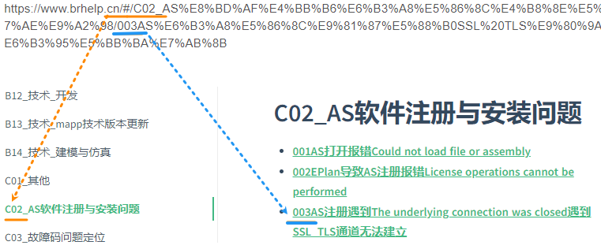
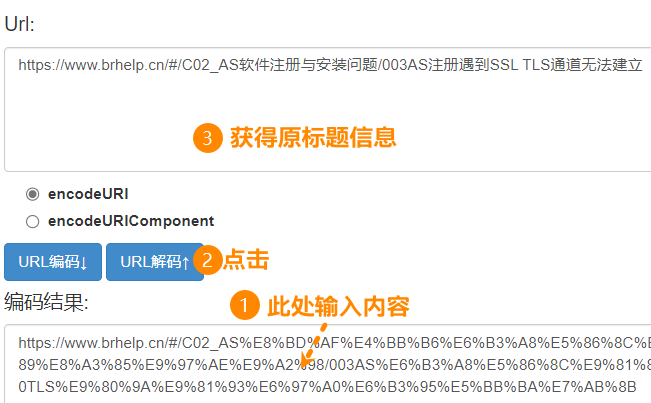

# 1 通过前缀数字查找

- 所有的文章大类均以类似 C02 开头，子条目均以 003 等三位数字开头
- 可查看确认链接中的相关信息，进行定位。
    - 

# 2 通过URL获得原文信息，重新搜索

- 所有的链接，实际即为中文标题的URL，我们可通过URL转码工具，获得其原始信息，并查找。
- [URL在线编码转换工具 - 编码转换工具 - W3Cschool](https://www.w3cschool.cn/tools/index?name=urlencode_decode)
    - 
