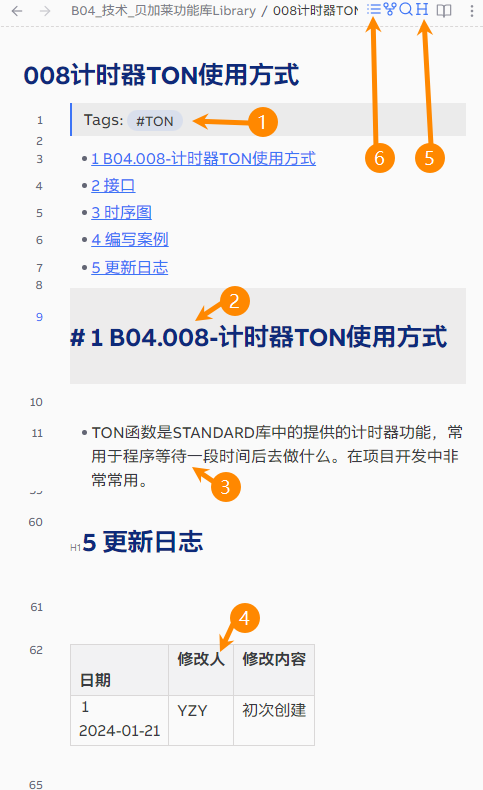

> Tags: #流程

- [1 Obsidian.Usage-使用模版创建文件方式](#_1-obsidianusage-%E4%BD%BF%E7%94%A8%E6%A8%A1%E7%89%88%E5%88%9B%E5%BB%BA%E6%96%87%E4%BB%B6%E6%96%B9%E5%BC%8F)
- [2 操作流程示例](#_2-%E6%93%8D%E4%BD%9C%E6%B5%81%E7%A8%8B%E7%A4%BA%E4%BE%8B)
- [3 功能按键说明](#_3-%E5%8A%9F%E8%83%BD%E6%8C%89%E9%94%AE%E8%AF%B4%E6%98%8E)
- [4 操作流程](#_4-%E6%93%8D%E4%BD%9C%E6%B5%81%E7%A8%8B)

# 1 Obsidian.Usage-使用模版创建文件方式

# 2 操作流程示例

# 3 功能按键说明

# 4 操作流程

- 1___写 Tag 标签
- 2___写 H1 标题内容，以 A01.001-标题为样式
- 3___写内容
- 4___写末尾的修改记录
- 5___光标指在Tag与H1标题之间，按右上角 H 按钮，自动标号
- 6___点击右上角三条横线按钮，创建目录
- 7___按 `CTRL + S` 自动格式化
- 示例
    - 
