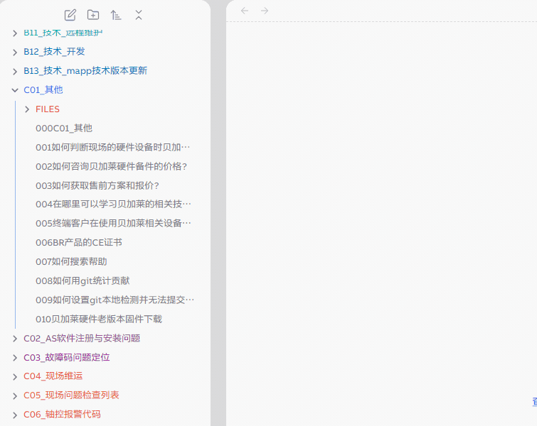

> 使用模版创建文件方式

- [1 操作流程](#1%20%E6%93%8D%E4%BD%9C%E6%B5%81%E7%A8%8B)
- [2 功能按键说明](#2%20%E5%8A%9F%E8%83%BD%E6%8C%89%E9%94%AE%E8%AF%B4%E6%98%8E)
- [3 修改完成后，按 `CTRL + S` 自动格式化](#3%20%E4%BF%AE%E6%94%B9%E5%AE%8C%E6%88%90%E5%90%8E%EF%BC%8C%E6%8C%89%20%60CTRL%20+%20S%60%20%E8%87%AA%E5%8A%A8%E6%A0%BC%E5%BC%8F%E5%8C%96)

# 1 操作流程

# 2 功能按键说明

# 3 修改完成后，按 `CTRL + S` 自动格式化
