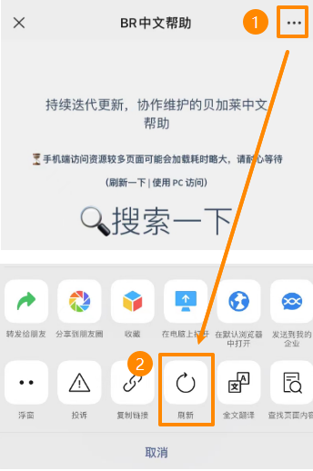

> #使用技巧

# 手机端访问注意事项

# [🏠回到首页](../../README.md)

# 只显示一部分内容 👉 等待 + 刷新

| Chrome浏览器 | 微信内浏览器 |
| :--- | :--- |
| 浏览器中，`下拉`，刷新 | 点击右上角 `...` 在下方弹出框点击 `刷新`   |
|  |    |

- ⏳手机端访问资源较多页面可能会加载耗时略大，需等待刷新
- （刷新一下 | 使用 PC 访问）

# 更新日志

| 日期         | 修改人 | 修改内容 |
| :--------- | :-- | :--- |
| 2023-12-02 | YZY | 初次创建 |
